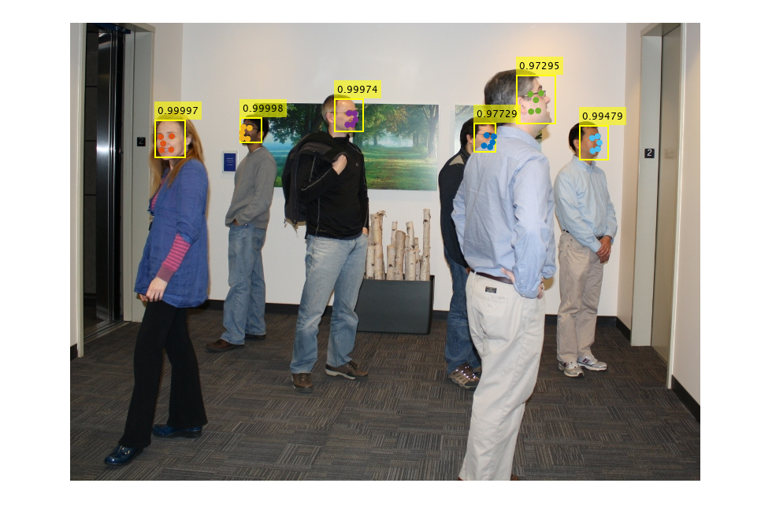
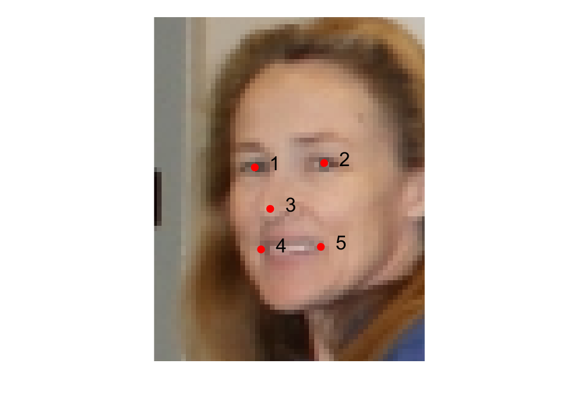

### Getting started

This example shows how to run face detection and alignment on an image.

### Face detection

The simplest way to use the face detector is the function
mtcnn.detectFaces this takes in an image and returns bounding boxes,
probability scores, and facial landmarks for each face detected.

``` matlab
im = imread("visionteam1.jpg");
[bboxes, scores, landmarks] = mtcnn.detectFaces(im);
fprintf("Found %d faces.\n", numel(scores));
```

``` output
Found 6 faces.
```

To visualise the results we can superimpose the bounding boxes and
landmarks on the original
image.

``` matlab
displayIm = insertObjectAnnotation(im, "rectangle", bboxes, scores, "LineWidth", 2);
imshow(displayIm)
hold on
for iFace = 1:numel(scores)
    scatter(landmarks(iFace, :, 1), landmarks(iFace, :, 2), 'filled');
end
```



### Facial landmarks

Landmarks detected are returned in the following order:

1.  Left eye
2.  Right eye
3.  Nose
4.  Left mouth corner
5.  Right mouth corner

Where left and right are as observed by camera.

``` matlab
figure();
imshow(im);
xlim([95, 150])
ylim([115, 185])
hold on
scatter(landmarks(2, :, 1), landmarks(2, :, 2), 100, "r", "filled");
text(landmarks(2, :, 1)+3, landmarks(2, :, 2)-1, string(1:5), "FontSize", 25);
```



### Detection speed

For best detection speed you should manually create a detector object
using mtcnn.Detector, then call its detect method. This will ensure that
network parameters are loaded before the actual detection occurs.

``` matlab
detector = mtcnn.Detector();
tic();
[~, scores, ~] = detector.detect(im);
timeTaken = toc();
fprintf("Found %d faces in %.3f seconds.\n", numel(scores), timeTaken);
```

``` output
Found 6 faces in 0.544 seconds.
```

If you know the expected scale of your face there are also several
Name-Value optional arguments which can be used to control the details
of face
detection

``` matlab
detector = mtcnn.Detector("MinSize", 24, "MaxSize", 48, "PyramidScale", 2);
tic();
[~, scores, ~] = detector.detect(im);
timeTaken = toc();
fprintf("Found %d faces in %.3f seconds.\n", numel(scores), timeTaken);
```

``` output
Found 6 faces in 0.209 seconds.
```

If you have a GPU on your machine, you might see further perfromance
improvments by setting "UseGPU" to true. For more details of these
parameters type help mtcnn.detectFaces.

_Copyright 2019 The MathWorks, Inc._